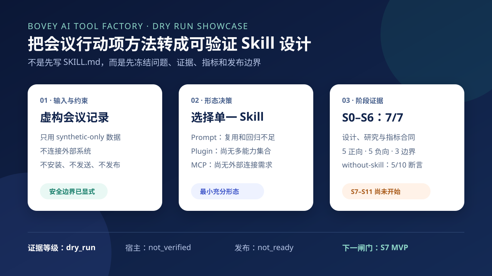

# 示例｜把会议行动项方法转成可验证 Skill 设计

> 一份虚构会议记录，如何经过问题定义、方法研究、指标设计和形态选择，形成可继续开发的 Skill 产品合同。



## 给什么

`fixtures/虚构会议记录-01.md` 是专为本示范编写的虚构会议记录，不对应任何真实客户或个人。

示范请求：

```text
把会议行动项提取与跟进做成一个博维内部 AI 工具。使用虚构数据；
先判断应该做成 Skill、Plugin 还是 MCP，再形成设计、指标和评测合同。
本轮只完成 S0-S6，不构建、不安装、不发送。
```

## 得到什么

| 结果 | 本示范的实际状态 |
|---|---|
| 工具形态 | 选择单一 `Skill`；当前没有多能力统一安装或外部系统连接需求 |
| 产品合同 | 明确输入、三类输出、九个字段、安全边界和停手条件 |
| 评测合同 | 5 个正向、5 个负向、3 个边界场景 |
| 探索性基线 | without-skill 单样本通过 5/10 个断言 |
| 阶段状态 | S0-S6 通过，S7-S11 未开始 |
| 发布状态 | `not_ready`；宿主为 `not_verified` |

## 看哪些文件

- `outputs/产品设计摘要.md`：为什么选择 Skill，以及必须交付什么。
- `outputs/研究与指标摘要.md`：S2 方法证据、S3 同类方案和 S4 指标合同。
- `outputs/eval-catalog.json`：13 个评测场景的类型和断言数量目录。
- `outputs/without-skill基线.md`：当前普通整理在哪些断言上掉链子。
- `outputs/stage-status.json`：哪些阶段有证据，下一闸门是什么。
- `assets/结果卡.svg`：可截图使用的示范结果卡。

## 一条命令验证

在 Plugin 根目录运行：

```powershell
python scripts/verify_showcase.py
```

验证器会检查文件完整性、逐阶段证据锚点、5/5/3 用例目录、基线表格 5/10 重算、结果卡状态、角色白名单、证据等级、发布边界和绝对路径/凭据/常见身份特征。通过时输出 JSON，失败时返回非零退出码。

## 证据边界

- 本示范使用虚构数据，证据等级为 `dry_run`。
- 本示范只证明工厂能形成 S0-S6 产品设计与评测合同。
- 它不证明目标 Skill 已构建，也不证明真实宿主触发率或业务增益。
- 没有执行邮件发送、消息发送、任务系统写入、安装或公开发布。
